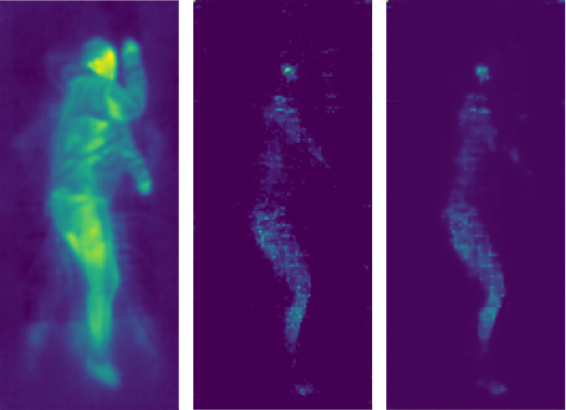
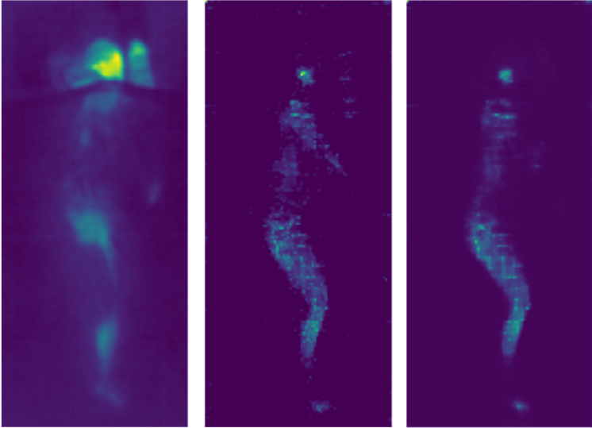
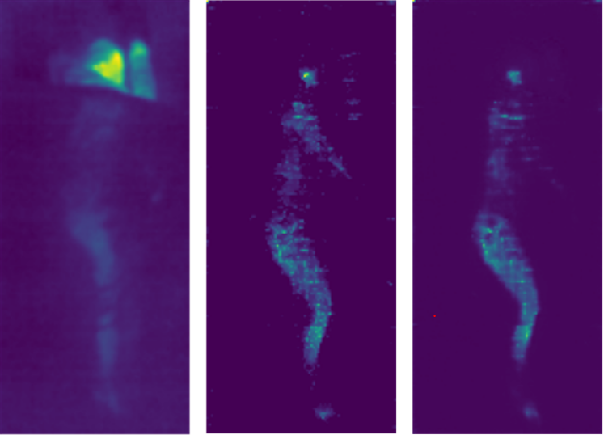

# Estimation of the pressure map of a human body on a mattress from infrared images
Despite the successes of deep neural networks in visual tasks, their application in practical medical settings remains limited. One of the persistent challenges is measuring the pressure of a human body on a mattress, crucial information for preventing pressure ulcers in patients hospitalized for extended periods. Traditional technologies, such as pressure sensors, have limitations such as cost and the need for calibration. In this context, we propose using infrared images to estimate the pressure map. This approach, involving the implementation of a UNET network and the use of the SLP (Simultaneously-collected multimodal Lying Pose) dataset for training, promises an effective and economical alternative for pressure monitoring in hospitalized patients.

## Env Setup
This project is developed under python3.8/Anaconda 3. Please check requirements.txt for required packages.

## Dataset
Apply to get access to the dataset 

https://ostadabbas.sites.northeastern.edu/slp-dataset-for-multimodal-in-bed-pose-estimation-3/ 

## Getting started
To train a model, execute:

`python3 main.py`

In the `config.py` file you will find the training configuration, paths and parameters.

## Extra testing with UAB data
In the `testing_uab.ipynb` file you will find how we load the UAB data and test a model with it

## Comparison

## Citation

## Acknowledgement
- https://github.com/ostadabbas/SLP-Dataset-and-Code
- https://github.com/ostadabbas/PressureEye

Also, special thanks to Vanessa Moreno Font, David Castells Rufas and Ganyong Mo for the help and collaboration in this project.
